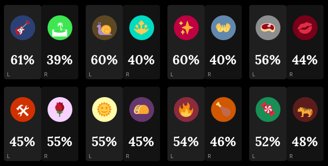

# blaseball-lr
A blaseball userstyle that puts little "L" and "R" markers on teams on the new bets page, for people doing dutch betting.

Requires [Stylus](https://add0n.com/stylus.html).

[Install blaseball-lr here](https://github.com/Absotively/blaseball-lr/raw/main/blaseball-lr.user.css).

It looks like this:

